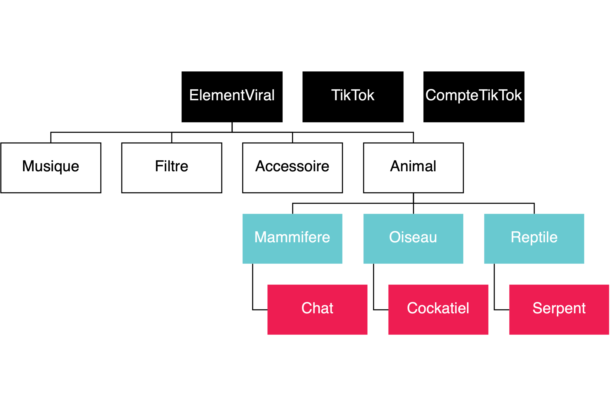
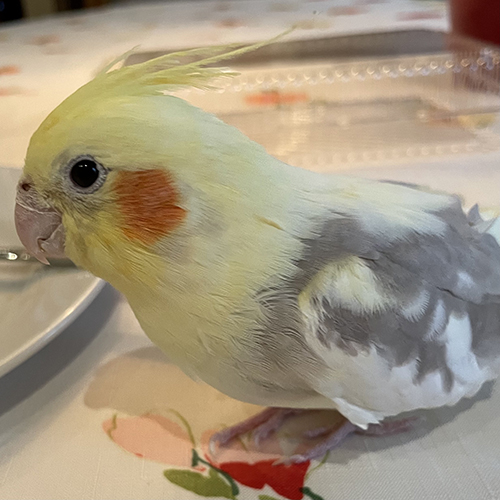
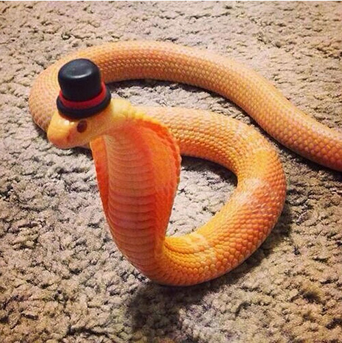

# TP5 : Classes et objets, héritage et polymorphisme

:alarm_clock: Date de remise: 27 novembre 2022 à 23h59


## Objectif

* Affuter votre savoir-faire en programmation orientée objet
* Vous familiariser avec les notions de polymorphisme et héritage
* Intégrer les bonnes pratiques de programmation dans votre code

## Directives particulières

* Respecter le [guide de codage](https://github.com/INF1007-Gabarits/Guide-codage-python) et les normes pep8
* Noms de variables et fonctions adéquats (concis, compréhensibles)
* Pas de librairies externes autres que celles déjà importées
* Dans chaque programme, vous pouvez ajouter d’autres fonctions à celles décrites dans l’énoncé pour améliorer la
  lisibilité
  
## Énoncé du travail

Vous êtes perdus dans vos études et vous cherchez une reconversion professionnelle. 
Vous vous êtes rendu compte que maintenant il est de plus en plus facile de gagner sa vie à l'aide des réseaux sociaux et plus particulièrement grâce à TikTok. 
Cependant, vous voulez garder votre anonymat et ne pas diffuser votre visage partout sur le net. Vous avez trouvé la solution : faire des TikTok avec vos animaux. 
Il faut maintenant trouver le bon animal, avec la bonne musique, le bon filtre, les bons accessoires pour vous permettre de percer sur les réseaux et de vivre à plein temps de cette activité. 
Vous avez donc pensé à faire un simulateur de vues TikTok afin de choisir au mieux parmi vos animaux celui qui vous propulsera en n°1. 

Votre simulateur se composera de 12 classes à compléter ainsi que le fichier main.py :

|     Classe      |
|-----------------|
| ElementViral    | 
| Musique         | 
| Filtre          | 
| TikTok          | 
| CompteTikTok    | 
| Accessoire      | 
| Animal          |
| Mammifere       | 
| Reptile         | 
| Oiseau          | 
| Chat            | 
| Serpent         |
| Cockatiel       | 

ATTENTION : Il est conseillé de compléter les TODO du fichier main.py au fur et à mesure du TP pour tester votre code.

---

## Table des matières

- [Modèle](#modèle)
- [Modules à implanter](#modules-à-implanter)
  - [Module éléments tiktok](#module-éléments-tiktok)
    - [La classe ElementViral](#la-classe-elementviral)
    - [La classe Musique](#la-classe-musique)
    - [La classe Filtre](#la-classe-filtre)
  - [Module Accessoire](#module-accessoire)
    - [La classe Accessoire](#la-classe-accessoire)
  - [Module Animal](#module-animal)
    - [La classe Animal](#la-classe-animal)
  - [Module Mammifere](#module-mammifere)
    - [La classe Mammifere](#la-classe-mammifere)
    - [La classe Chat](#la-classe-chat)
  - [Module Oiseau](#module-oiseau)
    - [La classe Oiseau](#la-classe-oiseau)
    - [La classe Cockatiel](#la-classe-cockatiel)
  - [Module Reptile](#module-reptile)
    - [La classe Reptile](#la-classe-reptile)
    - [La classe Serpent](#la-classe-serpent)
  - [Module TikTok](#module-tiktok)
    - [La classe TikTok](#la-classe-tiktok)
    - [La classe CompteTikTok](#la-classe-comptetiktok)
  - [Module main](#module-main)
 - [Barème](#barème)
 - [Annexe : Guide et normes de codage](#annexe--guide-et-normes-de-codage)
 - [Sources](#sources)
---
  
## Modèle 


Diagramme de classe

### ElementViral

Classe **abstraite** dont héritent tous les éléments que peuvent contenir vos vidéos TikTok. 

---

### Musique 

Classe fille de `ElementViral` 

#### Description 

Classe représentant une musique de TikTok.

#### Attributs 

A deux attributs : 
- `str` titre : Titre de la musique 
- `int` nb_ecoutes : Nombre d'écoutes en ligne de cette musique 

---

### Filtre 

Classe fille de `ElementViral` 

#### Description 

Classe représentant un filtre TikTok.

#### Attributs 

A deux attributs : 
- `str` nom : Nom du filtre
- `int` nb_utilisations : Nombre de fois où ce filtre a été utilisé

---

### TikTok 

#### Description 

Classe représentant une vidéo TikTok

#### Attributs 

A quatre attributs : 
- `str` titre : Titre du TikTok
- `Musique` musique : Musique du TikTok
- `Filtre` filtre : Filtre du TikTok
- **_PRIVÉ_** `List[Animal]` animaux : Liste des animaux présents dans le TikTok 

---

### CompteTikTok 

#### Description 

Classe représentant votre compte TikTok

#### Attributs 

A un attribut : 
- **_PRIVÉ_** `List[TikTok]` tiktoks : Liste des TikTok de votre compte

---

### Accessoire 

Classe fille de `ElementViral` 

#### Description 

Classe représentant des accessoires que vous pouvez utiliser dans vos TikTok.

#### Attributs 

A trois attributs : 
- `TypeAccessoire` type_accessoire : type d'accessoire entre chapeau, chaussures bijou et vêtement
- `str` nom : Nom de votre accessoire 
- `int` niveau_mignonnerie : Entier qui définit à quel point l'accessoire est mignon

---

### Animal 

Classe fille de `ElementViral`

#### Description 

Classe représentant un animal d'un ordre et d'une espèce quelconque

#### Attributs 

A trois attributs : 
- `str` nom : Nom de l'animal
- `int` nb_pattes : Nombre de pattes de l'animal
- `List[Accessoire]` liste_accessoires : Liste des accessoires que porte l'animal dans le TikTok. Elle est vide à l'initialisation.

---

### Mammifere 

Classe fille de `Animal`

#### Description 

Classe représentant un mammifère de toute espèce

#### Attributs 

A quatre attributs : 

Hérité d'`Animal`:
- `str` nom : Nom de l'animal
- `int` nb_pattes : Nombre de pattes de l'animal
- `List[Accessoire]` liste_accessoires : Liste des accessoires que porte l'animal dans le TikTok. Elle est vide à l'initialisation.

Propre à `Mammifere`:
- `LongueurPoils` longueur_poils : Longueur des poils du mammifère entre rasés, courts et longs

---

### Oiseau 

Classe fille de `Animal`

#### Description 

Classe représentant un oiseau de toute espèce

#### Attributs 

A quatre attributs :

Hérité d'`Animal`:
- `str` nom : Nom de l'animal
- `int` nb_pattes : Nombre de pattes de l'animal
- `List[Accessoire]` liste_accessoires : Liste des accessoires que porte l'animal dans le TikTok. Elle est vide à l'initialisation.

Propre à `Oiseau`:
- `bool` chante : `True` si l'oiseau chante, `False` sinon

---

### Reptile 

Classe fille de `Animal`

#### Description 

Classe représentant un reptile de toute espèce

#### Attributs 

A quatre attributs :

Hérité d'`Animal`:
- `str` nom : Nom de l'animal
- `int` nb_pattes : Nombre de pattes de l'animal
- `List[Accessoire]` liste_accessoires : Liste des accessoires que porte l'animal dans le TikTok. Elle est vide à l'initialisation.

Propre à `Reptile`:
- `bool` est_nocture : `True` si le reptile est nocturne, `False` s'il est diurne

---

### Chat 

Classe fille de `mammifere`

#### Description 

Classe représentant un chat

#### Attributs 

A cinq attributs :

Hérité d'`Animal`:
- `str` nom : Nom de l'animal
- `int` nb_pattes : Nombre de pattes de l'animal
- `List[Accessoire]` liste_accessoires : Liste des accessoires que porte l'animal dans le TikTok. Elle est vide à l'initialisation.

Hérité de `Mammifere`:
- `LongueurPoils` longueur_poils : Longueur des poils du mammifère entre rasés, courts et longs

Propre à `Chat`
- `str` couleur : La couleur des poils du chat 


Wako le Chat

---

### Cockatiel 

Classe fille de `Oiseau`

#### Description 

Classe représentant un Cockatiel

#### Attributs 

A quatre attributs : 

Hérité d'`Animal`:
- `str` nom : Nom de l'animal
- `int` nb_pattes : Nombre de pattes de l'animal
- `List[Accessoire]` liste_accessoires : Liste des accessoires que porte l'animal dans le TikTok. Elle est vide à l'initialisation.

Hérité de `Oiseau`:
- `bool` chante : **Fixé à `True`**



Cookie le Cockatiel

---

### Serpent 

Classe fille de `Reptile`

#### Description 

Classe représentant un serpent

#### Attributs 

A cinq attributs : 

Hérité d'`Animal`:
- `str` nom : Nom de l'animal
- `int` nb_pattes : **Fixé à `0`**
- `List[Accessoire]` liste_accessoires : Liste des accessoires que porte l'animal dans le TikTok. Elle est vide à l'initialisation.

Hérité de `Reptile`:
- `bool` est_nocture : `True` si le reptile est nocturne, `False` s'il est diurne

Propre à `Serpent`
- `bool` est_venimeux : `True` si le serpent est venimeux, `False` sinon



Bob le Serpent [0]

---

## Modules à implanter

## Module éléments TikTok

Dans le fichier `elements_tiktok.py`, complétez :

### La classe ElementViral

C'est une classe **abstraite** sans attributs. 

Elle possède une méthode abstraite `score_viral`.

Ajoutez les éléments nécessaires pour qu'elle soit définie comme une classe abstraite.

---

### La classe Musique

### Le constructeur `__init__`

Implémentez son constructeur. 

Il prend en paramètre :
- `str` titre : Titre de la musique 
- `int` nb_ecoutes : Nombre d'écoutes de la musique 

### `score_viral`

Implémentez cette fonction. 

Ne prends aucun paramètre.

Renvoie le score_viral (`int`) d'un objet Musique.

Le score_viral d'une musique est égal au nombre d'écoutes de la musique **divisé par 10 000**.

---

### La classe Filtre

### Le constructeur `__init__`

Implémentez son constructeur. 

Il prend en paramètre :
- `str` nom : Nom du filtre
- `int` nb_utilisations : Nombre d'utilisations du filtre sur TikTok

### `score_viral`

Implémentez cette fonction. 

Ne prends aucun paramètre.

Renvoie le score_viral (`int`) d'un objet Filtre.

Le score_viral d'un filtre est égal au nombre d'utilisations du filtre **divisé par 50 000**.

---

## Module Accessoire

Dans le fichier `accessoire.py`, complétez :

### La classe Accessoire

### Le constructeur `__init__`

Implémentez son constructeur. 

C'est une classe fille de ElementViral

Il prend en paramètre :
- `str` nom : Nom de l'accessoire
- `int` niveau_mignonnerie : Niveau de mignonnerie de l'accessoire
- `TypeAccessoire` type_accessoire : Type de l'accessoire

### Méthode `__str__` 

Cette méthode retourne la chaine de caractères qui sera renvoyée lorsque vous utiliserez `str()` sur votre objet de type Accessoire. 

Implémentez-la pour qu'elle retourne : 
```text
type : TYPE_ACCESSOIRE, nom : NOM_ACCESSOIRE, niveau de mignonnerie : NIVEAU_DE_MIGNONNERIE
```

### Méthode `score_viral`

Cette méthode retourne le score viral de l'Accessoire avec lequel vous l'appelez.

La classe ne prend aucun attribut en paramètre.

Elle retourne un **entier** (`int`) selon la formule suivante:

```text
score_viral = NIVEAU_DE_MIGNONNERIE * MULTIPLICATEUR * 10 000
```

### Tableau des multiplicateurs

|    Type    | Multiplicateur |
|------------|----------------|
| CHAPEAU    |            1.5 |
| CHAUSSURES |            1.2 |
| BIJOU      |            0.8 |
| VETEMENTS  |              1 |

---

## Module Animal

Dans le fichier `animal.py`, complétez :

### La classe Animal

Classe fille de `ElementViral`.

La classe Animal est une classe **abstraite**.

Ajoutez les éléments nécessaires pour qu'elle soit définie comme une classe abstraite.

### Le constructeur `__init__`

Implémentez son constructeur. 

La création d'un Animal prend 2 attributs en paramètre : 
- `str` nom : Le nom de l'animal 
- `int` nb_pattes : Le nombre de pattes de l'animal

### Surcharge de l'opérateur + : `__add__`
  
Surchargez l'opérateur + pour que lorsque l'on additionne un Animal à un Accessoire cela retourne la somme du score_viral de l'Animal et du score_viral de l'Accessoire.

### Surcharge de l'opérateur += : `__iadd__`
  
Surchargez l'opérateur += pour que lorsque l'on fait Animal += Accessoire, l'Accessoire est ajouté à liste_accessoires de l'Animal.
  
**ATTENTION : On ne peut pas mettre de chaussures à un animal qui n'a pas de pattes.**
Dans ce cas, ne modifiez pas la liste_accessoire et affichez un message :
```text
Vous ne pouvez pas mettre de chaussures à un animal sans pieds
```

### Méthode `crier` 
  
Méthode abstraite ne prenant aucun paramètre.

Ajoutez les éléments nécessaires pour qu'elle soit définie comme une méthode abstraite.

### `score_viral`

Implémentez cette méthode qui retourne le score_viral de l'Animal, c'est-à-dire la somme du score_viral des Accessoires présents dans liste_accessoires.

### `calcul_meilleur_animal`
  
Implémentez cette fonction qui retourne l'Animal avec le niveau de score_viral le plus élevé.

Elle retourne un tuple qui contient le nom de l'Animal et son score_viral.

---

## Module Mammifere

Dans le fichier `mammifere.py`, complétez :
  
### La classe Mammifere
  
Classe fille de `Animal`.

La classe Mammifere est une classe **abstraite**.

Ajoutez les éléments nécessaires pour qu'elle soit définie comme une classe abstraite.

### Le constructeur `__init__`
  
Implémentez le constructeur de la classe

La création d'un Mammifere prend 3 attributs en paramètre : 
- str `nom` : Le nom de l'animal 
- entier `nb_pattes` : Le nombre de pattes de l'animal
- LongueurPoils `longueur_poils` : La longueur des poils du Mammifere

**Faites bien attention à appeler le constructeur de la classe Animal**

### Méthode `__str__` 

Cette méthode retourne la chaine de caractères qui sera renvoyée lorsque vous utiliserez `str()` sur votre objet de type Mammifere. 

Implémentez-la pour qu'elle retourne : 

```text
Le TYPE_MAMMIFERE NOM_MAMMIFERE a NB_PATTES pattes et des poils LONGUEUR_POILS.
```  

Vous pouvez accéder au type de Mammifere en faisant : `type(self).__name__`

---
  
### La classe Chat

Classe fille de `Mammifere`.

### Le constructeur `__init__`

Implémentez son constructeur. 

La création d'un Chat prend 4 attributs en paramètre : 
- `str` nom : Le nom de l'animal 
- `int` nb_pattes : Le nombre de pattes de l'animal, **par défaut = 4, car c'est un chat**
- `LongueurPoils` longueur_poils : La longueur des poils du Mammifere
- `str` couleur : La couleur du chat

**Faites bien attention à appeler le constructeur de la classe Mammifere**

### Méthode `crier` 
  
Retourne le cri du Chat, c'est-à-dire "Miaou"

---

## Module Oiseau

Dans le fichier `oiseau.py`, complétez :
  
### La classe Oiseau

Classe fille de `Animal`.

La classe Oiseau est une classe **abstraite**.

Ajoutez les éléments nécessaires pour qu'elle soit définie comme une classe abstraite.

### Le constructeur `__init__`

Implémentez son constructeur. 
  
La création d'un Oiseau prend 3 attributs en paramètre : 
- `str` nom : Le nom de l'animal 
- `int` nb_pattes : Le nombre de pattes de l'animal
- `bool` chante : `True` si l'Oiseau chante, `False` sinon

**Faites bien attention à appeler le constructeur de la classe Animal**

### Méthode `__str__` 

Cette méthode retourne la chaine de caractères qui sera renvoyée lorsque vous utiliserez `str()` sur votre objet de type Oiseau. 

Implémentez-la pour qu'elle retourne : 

```text
Le TYPE_OISEAU NOM_OISEAU chante. 
```

ou 

```text
Le TYPE_OISEAU NOM_OISEAU ne chante pas. 
```

Vous pouvez accéder au type de Oiseau en faisant : `type(self).__name__`

### Méthode `crier` 

Contrairement à un Mammifere, pour un Oiseau nous n'avons pas besoin de savoir de quel type d'oiseau il s'agit pour savoir son chant. 
En effet, si un oiseau ne chante pas il se contente de faire cuicui et s'il chante, il chante deux les premières phrases du refrain de [September](https://www.youtube.com/watch?v=tyqYwHK99N8).

Nous pouvons donc implémenter cette méthode dans la classe Oiseau et non pas dans les classes filles de la classe Oiseau.

Implémentez cette méthode avec une des deux valeurs de retour suivantes :

| Chante  |                               Cri                                |
|---------|------------------------------------------------------------------|
| `False` | Cuicui                                                           |
| `True`  | Ba de ya, say that you remember. Ba de ya, dancing in September. |

---

### La classe Cockatiel

Classe fille de `Oiseau`.

### Le constructeur `__init__`

Implémentez son constructeur. 
  
La création d'un Cockatiel prend 2 attributs en paramètre : 
- `str` nom : Le nom de l'animal 
- `int` nb_pattes : Le nombre de pattes de l'animal

**Faites bien attention à appeler le constructeur de la classe Oiseau**

Notez bien qu'un Cockatiel chante toujours! Ajustez l'appel au constructeur de Oiseau pour bien se calquer à [la réalité des Cockatiels](https://www.youtube.com/watch?v=WvYqqjsYE6I).

---

## Module Reptile

Dans le fichier `reptile.py`, complétez :
  
### La classe Reptile

Classe fille de `Animal`.

La classe Reptile est une classe **abstraite**.

Ajoutez les éléments nécessaires pour qu'elle soit définie comme une classe abstraite.

### Le constructeur `__init__`

La création d'un Reptile prend 3 attributs en paramètre : 
- `str` nom : le nom de l'animal 
- `int` nb_pattes : le nombre de pattes de l'animal
- `bool` est_nocturne : `True` si le Reptile est nocturne, `False` s'il est diurne

**Faites bien attention à appeler le constructeur de la classe Animal**

### Méthode `__str__` 

Cette méthode retourne la chaine de caractères qui sera renvoyée lorsque vous utiliserez `str()` sur votre objet de type Reptile. 

Implémentez-la pour qu'elle retourne : 

```text
Le TYPE_REPTILE NOM_REPTILE est nocturne.
```

ou 

```text
Le TYPE_REPTILE NOM_REPTILE est diurne.
```

Vous pouvez accéder au type de Reptile en faisant : `type(self).__name__`

---

### La classe Serpent

Classe fille de `Reptile`.

### Le constructeur `__init__`

Implémentez son constructeur. 
  
La création d'un Serpent prend 3 attributs en paramètre : 
- `str` nom : le nom de l'animal 
- `bool` est_nocturne : `True` si le Reptile est nocturne, `False` s'il est diurne
- `bool` est_venimeux : `True` si le Serpent est venimeux, `False` sinon

**Faites bien attention à appeler le constructeur de la classe Reptile**

Notez bien qu'un Serpent n'a pas de pattes! Ajustez l'appel au constructeur de Reptile.

### Méthode `__str__` 

Cette méthode retourne la chaine de caractères qui sera renvoyée lorsque vous utiliserez `str()` sur votre objet de type Serpent. 

Implémentez-la pour qu'elle retourne :

| Norturne | Venimeux |                            Valeur de retour                            |
|----------|----------|------------------------------------------------------------------------|
| `False`  | `False`  | Le TYPE_REPTILE NOM_REPTILE n'est pas nocturne. Il n'est pas venimeux. |
| `False`  | `True`   | Le TYPE_REPTILE NOM_REPTILE n'est pas nocturne. Il est venimeux.       |
| `True`   | `False`  | Le TYPE_REPTILE NOM_REPTILE est nocturne. Il n'est pas venimeux.       |
| `True`   | `True`   | Le TYPE_REPTILE NOM_REPTILE est nocturne. Il est venimeux.             |
  
**Utilisez la méthode `__str__` de la classe Reptile.**
Vous pouvez y faire appel en faisant : `super(Serpent, self).__str__()`

### Méthode `crier` 
 
Retourne le cri du Serpent, c'est-à-dire "sssss"

---

## Module TikTok

Dans le fichier `tiktok.py`, complétez :
  
### La classe TikTok

### Le constructeur `__init__`

Implémentez son constructeur. 
	
La création d'un TikTok prend 1 attribut en paramètre : 
- `str` titre : Titre du TikTok

### Méthode `ajouter_animal` 
	
Cette méthode prend en paramètre un `Animal`.
	
Cette méthode ajoute un `Animal` à la liste animaux du TikTok.
	
Elle retourne le TikTok avec la liste mise à jour. 
	
### Méthode `vues`

Cette méthode retourne le nombre de vues potentielles de votre TikTok. Il s'agit de la formule secrète de notre simulateur!

Le nombre de vues potentiel est égal à :
```text
vues = SCORE_MUSIQUE + SCORE_FILTRE + NOMBRE_ANIMAUX* SOMME(SCORE_ANIMAUX)
```

S'il n'y a pas de musique ou de filtre, leur score est égal à 0.

### Méthode `__str__` 

Cette méthode retourne la chaine de caractères qui sera renvoyée lorsque vous utiliserez `str` sur votre objet de type TikTok. 

Implémentez-la pour qu'elle retourne : 
	
```text
TITRE (VUES vues)
```
	
### Surcharge de l'opérateur < : `__lt__` 
			
Surchargez l'opérateur < pour que lorsque l'on compare deux TikTok (tiktok1 < tiktok2) cela retourne `True` si les vues de tiktok1 sont inférieures aux vues du tiktok2. 

---

### La classe CompteTikTok

### Le constructeur `__init__`

Implémentez son constructeur. 
	
La création d'un CompteTikTok prend 1 attribut en paramètre : 
- `str` identifiant : identifiant du compte TikTok
	
### Surcharge de len() : `__len__` 

Surchargez len pour que lorsque l'on fait len(COMPTE_TIKTOK) cela renvoie le nombre de TikTok du compte.
	
### Surcharge de l'opérateur += :   `__iadd__`
  
Surchargez l'opérateur += pour que lorsque l'on fait CompteTikTok += TikTok, le TikTok soit ajouté à tiktoks du CompteTikTok

### Méthode `vues`

Cette méthode retourne le nombre de vues potentielles de votre compte TikTok. 
Le nombre de vues potentiel est égal à la somme des vues des TikToks présents dans la liste tiktoks.

### Méthode `tiktoks_plus_populaires`
	
Cette méthode retourne les TikTok dans la liste tiktoks triés par ordre croissant de vues.

---
	
## Module main

Dans le fichier `tiktok.py`, complétez :

Dans la fonction `main`, complétez les TODO et retournez l'instance `CompteTikTok` créée.

---

## Barème

| Classe / Module   | Points attribués |
|-------------------|------------------|
| ElementViral      | 2                |
| Musique           | 2                |
| Filtre            | 2                |
| TikTok            | 5                |
| CompteTikTok      | 5                |
| Accessoire        | 4                |
| Animal            | 4                |
| Mammifere         | 3                |
| Chat              | 2                |
| Oiseau            | 3                |
| Cockatiel         | 2                |
| Reptile           | 3                |
| Serpent           | 3                |
| main              | 5                |
| Total             | / 45             |

## Annexe : Guide et normes de codage

- [Le guide maison](https://github.com/INF1007-Gabarits/Guide-codage-python) de normes supplémentaires à respecter
- [Le plugin Pycharm Pylint](https://plugins.jetbrains.com/plugin/11084-pylint) qui analyse votre code et indique
  certaines erreurs.
- [Quelques indications en français sur PEP8](https://openclassrooms.com/fr/courses/4425111-perfectionnez-vous-en-python/4464230-assimilez-les-bonnes-pratiques-de-la-pep-8)
- [La documentation PEP8 officielle](https://www.python.org/dev/peps/pep-0008/)

## Sources

[0] https://www.thesun.co.uk/news/9817839/snake-bespoke-hats-pets-instagram/
